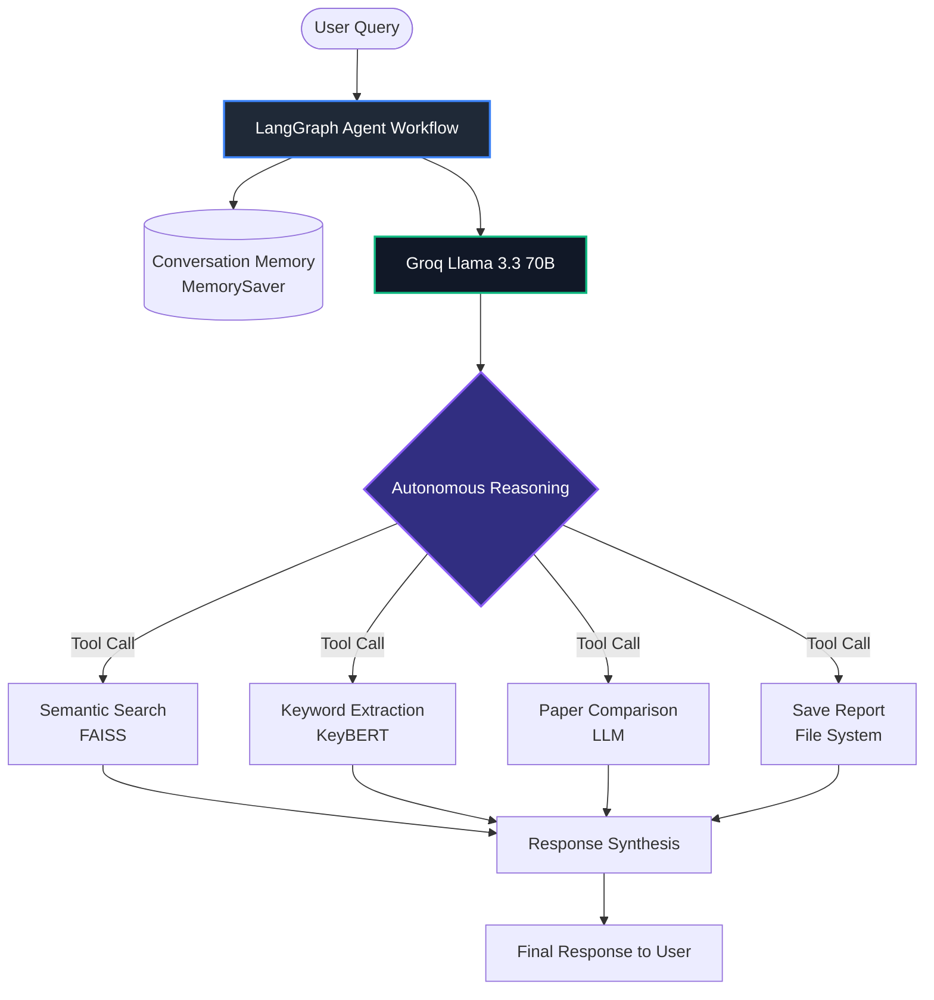

# 🤖 Autonomous Agentic AI Research System

<div align="center">
  
  
  
  
  
</div>

<br />

> **🎓 CBSOT Agentic AI Internship — Capstone Project 3**
>
> An **Autonomous Agentic AI Research Assistant** that discovers, analyzes, summarizes, and compares scientific papers through stateful memory and intelligent tool-calling capabilities.

---

## 🌟 Key Features

* **🧠 Stateful Conversation Memory**: Powered by LangGraph's `MemorySaver` to retain contextual history across complex multi-turn chats.
* **🔍 Semantic Search & Indexing**: Employs **FAISS** vector database for sub-millisecond retrieval of papers from a 15,000+ dataset.
* **📚 Sentence Transformers**: Utilizes `all-MiniLM-L6-v2` dense embeddings to perform high-accuracy mathematical similarity search.
* **📝 Deep summarization**: Built-in **BART** pipeline (`facebook/bart-large-cnn`) to distill research abstracts into highly readable summaries.
* **🏷️ Keyphrase Extraction**: Automatically extracts density-based keywords from texts using **KeyBERT**.
* **📊 Paper Comparison Matrix**: Autonomous comparative LLM reasoning that evaluates research papers side-by-side using key architectural parameters.
* **📁 Report Export Utility**: Automatically formats and saves generated research reports directly to local files.

---

## 📐 System Architecture

The following diagram illustrates the flow of queries through our stateful LangGraph agent:



---

## 🛠️ Tech Stack & Ecosystem

| Layer | Component | Description |
| :--- | :--- | :--- |
| **Agent Core** | LangGraph & LangChain | Manages custom tool calling nodes, state flow graphs, and memory buffers. |
| **Inference Engine** | Groq (Llama 3.3 70B) | Powers reasoning, tool selection, and paper comparison tasks. |
| **Vector DB** | FAISS (Facebook AI Similarity Search) | Stores and indexes 384-dimensional document embeddings. |
| **NLP Models** | Hugging Face Transformers & KeyBERT | Tokenization, BART-based summarization, and keyphrase extraction. |
| **Data Engine** | Pandas & NumPy | Cleans, structures, and processes raw scientific paper datasets. |

---

## 🚀 Quick Start & Installation

### 1. Clone the repository
```bash
git clone https://github.com/Rohitdey45/CBSOT_Project_3.git
cd CBSOT_Project_3
```

### 2. Set up Virtual Environment & Dependencies
```bash
# Create virtual environment
python -m venv venv

# Activate on Windows
.\venv\Scripts\activate

# Install dependencies
pip install -r Requirements.txt
```

### 3. Set up Environment Variables
Create a file named `.env` in the root directory:
```env
api=gsk_your_groq_api_key
```

### 4. Run the Agent
You can run the python script directly:
```bash
python CBSOT_Project_3.py
```
Or launch Jupyter to view the interactive notebook:
```bash
jupyter notebook CBSOT_Project_3.ipynb
```

---

## 👨‍💻 Author

**Rohit Dey**

---

<div align="center">
  <sub>Developed for the CBSOT Agentic AI Internship. If you found this project helpful, give it a ⭐!</sub>
</div>
